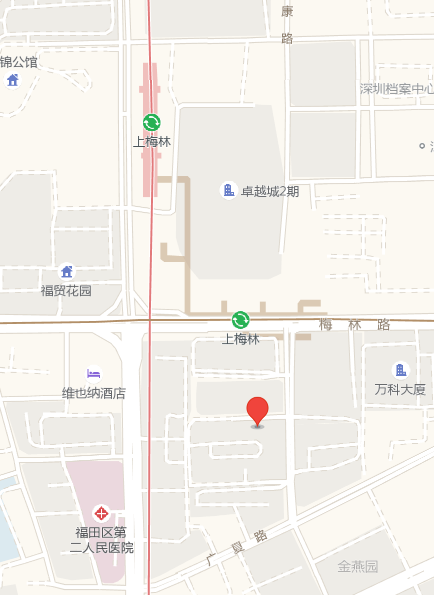

# OSDT 线上技术交流会 CIRCT 专场

近日，Chris Lattner 带领的 [CIRCT](https://github.com/llvm/circt) 项目已经开源并交给了 LLVM Foundation 托管。
CIRCT 含义是 Circuit IR Compilers and Tools，可以从仓库README看到建立的动机。
我们OSDT社区关注到CIRCT有可能成为最近一段时间以来开源EDA运动的一部分的，并且有可能跟 Google、lowRISC 等组织的开源项目组合起来产生无限的可能性。
同时也是更加短期和直接的，对于 Chisel/FIRRTL 会产生什么样的碰撞，是目前OSDT社区的成员最为关切的。

我们将在8月23日组织一场专门的技术讨论会，围绕 CIRCT、Chisel/FIRRTL 进行技术交流和观点讨论。欢迎报名进行技术报告或观点陈述。

## 活动时间 / Time

- 2020年8月23日上午10点（上海、东八时区）

## 活动议程 / Program

- 张洪滨 - MLIR及其编译过程与应用分享
- 韩博阳 - Introduction to FIRRTL
- 自由讨论环节

**张洪滨 - MLIR及其编译过程与应用分享**

分享MLIR的背景及其编译过程(MLIR Toy Tutorial)，分享MLIR在CIRCT中的应用。

演讲者张洪滨来自中科院软件所智能软件研究中心PLCT实验室。MLIR社区参与者、贡献者。

**韩博阳 - Introduction to FIRRTL**

分享 FIRRTL 编译器的安装，FIRRTL Spec简介，FIRRTL 编译器原理简介。

分享者韩博阳来自厦门大学，主要研究方向为计算机体系结构安全性及EDA工具。

## 直播观看

（永久地址，可收藏）

https://live.bilibili.com/10339607

不需要报名，直接看。弹幕提问需要登录。

## 视频会议参会

会议主题：OSDT讨论会CIRCT主题

会议时间：2020/8/23 10:00-12:00

点击链接入会，或添加至会议列表：
https://meeting.tencent.com/s/HyoQXKb69HhK

会议 ID：475 735 767

会议密码：65535

手机一键拨号入会
+8675536550000,,475735767# (中国大陆)
+85230018898,,,2,475735767# (中国香港)

根据您的位置拨号
+8675536550000 (中国大陆)
+85230018898 (中国香港)

## 演讲报名

目前仍可以进行闪电演讲，请联系OSDT社区负责人吴伟报名。直接负责人微信报名或通过 lazyparser at gmail.com 后台留言。

https://github.com/hellogcc/osdt-weekly/blob/master/images/hellogcc-wuwei.jpeg

## CFP call for proposals

近日，Chris Lattner 带领的 [CIRCT](https://github.com/llvm/circt) 项目已经开源并交给了 LLVM Foundation 托管。

CIRCT 含义是 Circuit IR Compilers and Tools，可以从仓库README看到建立的动机。

> Motivation
> The EDA industry has well-known and widely used proprietary and open source tools. However, these tools are inconsistent, have usability concerns, and were not designed together into a common platform. Furthermore these tools are generally built with Verilog (also VHDL) as the IRs that they interchange. Verilog has well known design issues, and limitations, e.g. suffering from poor location tracking support.
>
> The CIRCT project is an (experimental!) effort looking to apply MLIR and the LLVM development methodology to the domain of hardware design tools. Many of us dream of having reusable infrastructure that is modular, uses library-based design techniques, is more consistent, and builds on the best practices in compiler infrastructure and compiler design techniques.
>
> By working together, we hope that we can build a new center of gravity to draw contributions from the small (but enthusiastic!) community of people who work on open hardware tooling. In turn we hope this will propel open tools forward, enables new higher-level abstractions for hardware design, and perhaps some pieces may even be adopted by proprietary tools in time.
>
> For more information, please see our longer charter document.

我们OSDT社区关注到CIRCT有可能成为最近一段时间以来开源EDA运动的一部分的，并且有可能跟 Google、lowRISC 等组织的开源项目组合起来产生无限的可能性。同时也是更加短期和直接的，对于 Chisel/FIRRTL 会产生什么样的碰撞，是目前OSDT社区的成员最为关切的。

我们计划在八月组织一场专门的技术讨论会，围绕 CIRCT、Chisel/FIRRTL 进行技术交流和观点讨论。欢迎报名进行技术报告或观点陈述。

交流内容包含或相关：
- CIRCT
- Chisel/FIRRTL
- OpenROAD
- 其他开源EDA相关话题

报告和讨论使用中文。Slides等展示交流材料鼓励英文或双语。

本次报告默认提供B站直播和腾讯会议；线下是否举办待定，看最近两周杭州和上海的新冠肺炎疫情通告，OSDT社区工作组严格遵守自肃倡议。

## LLVM + RISC-V 技术讨论会 2020-07-05

Title: LLVM + RISC-V Meetup July 5th 2020

Hi all,

OSDT社区组织的 LLVM + RISC-V 技术讨论会将在7月5日周日上午10点开始。本次讨论的议题已经确定，活动形式采用线上 Zoom 会议 + B站直播的形式，欢迎国内外的小伙伴参与。报告以中文为主。

The next OSDT Meetup will happen on July 5th, 2020. The location is webinar style, using Bilibili live streaming and Zoom Meeting. Topics cover RISC-V software porting / enhancement and LLVM toolchain family.

本次活动由OSDT开源开发工具社区（含HelloGCC、HelloLLVM）与 Shanghai RISC-V Group 联合组织。感谢中科院软件所智能软件研究中心（ISRC）提供 Zoom 会议赞助。

We thank Shanghai RISC-V Group for event organization and I.S.C.A.S. for Zoom sharing. This meetup is hold by OSDT community (formerly HelloGCC and HelloLLVM communities).

### 活动时间 / Time

2020年7月5日 周日 10:00 AM - 12:00 AM

Sunday, July 5, 2020 at 10:00:00 am	CST	UTC+8 hours Shanghai

Saturday, July 4, 2020 at 7:00:00 pm	PDT	UTC-7 hours Las Vegas (USA - Nevada)

Sunday, July 5, 2020 at 02:00:00 Corresponding UTC (GMT)

### 活动议程 / Program

- 开场介绍（吴伟 as MC）
- Opening - Wei Wu (chair)
- 蒙斌 - VxWorks on RISC-V: 切换 LLVM 编译器遇到的一些问题分享
- Bin Meng - VxWorks on RISC-V: What we've learned about LLVM RISC-V toolchain
- MaskRay - Clang 的 gcov 实现
- MaskRay - GCov implementations in Clang
- 王萌 - Spike模拟器Snapshot功能技术方案及实现分享
- Meng Wang - implement snapshot feature for Spike RISC-V simulator
- 陈影 - 基于LLVM实现RISC-V用户自定义指令支持——以玄铁C910处理器为例
- Ying Chen - Custom ISA Support Using LLVM: XuanTie C910 as an example
- 自由话题讨论
- Free discussion

**蒙斌 - VxWorks on RISC-V: 切换 LLVM 编译器遇到的一些问题分享**

Bin Meng - VxWorks on RISC-V: What we've learned about LLVM RISC-V toolchain

分享 VxWorks 操作系统在支持 RISC-V 架构从 GCC 编译器切换到 LLVM 过程中遇到的各种“坑”.

In this talk we will share our lessons learned in the transition of using LLVM RISC-V toolchain to build VxWorks Operation System.

演讲者蒙斌来自风河系统中国研发中心，VxWorks 产品部门高级研发经理。开源社区积极参与者和贡献者，RISC-V 坚定的推广者 :)

Bin Meng is from WindRiver. He is the senior R&D manager in VxWorks Department. Bin is very active tech promoter for RISC-V and other open source communities.

**MaskRay - Clang 的 gcov 实现**

MaskRay - GCov implementations in Clang

GCC提供 gcov 用于实现code coverage。本次主题浅析clang对它的兼容实现和最近本人的一些改进。

gcov is a code coverage tool which originated from GNU GCC. In this talk MaskRay will introduce the gcov implementation in Clang, with a few new improvements realized by him.

MaskRay，一个活跃的LLVM开发者 (LLD+binary utilities 维护者，缓慢学习 clang/middle-end/CodeGen)，退休的Algo/CTF/Student Cluster Competition 选手 / emacs-lsp 维护者。ccls++🎉

MaskRay is an active LLVM developer (maintains LLD + Binary Utilities, learning clang/middle-end/codegen slowly), a retired Algo / CTF / Student Cluster Competition athlete / emacs-lsp maintainer. ccls++🎉

**王萌：Spike模拟器snapshot功能技术方案及实现分享**

Meng Wang - implement snapshot feature for Spike RISC-V simulator

Spike 是用于验证RISC-V程序的模拟器，使用 C++ 编写，提供了模拟一个或多个 RISC-V hart 的功能模型。我们在spike的基础上进行开发，为其实现 snapshot 即快照功能，用于程序状态的保存及恢复。目前，我们已经完成了部分功能开发，本次报告将针对其技术方案和具体实现进行介绍。

Spike is a simulator for RISC-V. We are implementing a few new features for Spike. In this talk, we will share details of our ongoing work for snapshot feature.

王萌，武汉大学大二和大三之间，PLCT实验室模拟器分支LV3实习生。指导老师：PLCT实验室李威威主管。

同时我们感谢中科院信工所宋威老师提出并完善了 snapshot 功能需要达到的各项功能指标。

Meng Wang is an undergraduate from Wuhan University. He is currently working with his intern mentor Weiwei Li in PLCT Lab as intern.

We thank Dr. Wei Song from IIE. The idea was provided by Dr. Song.

**陈影：基于LLVM实现RISC-V用户自定义指令支持——以玄铁C910处理器为例**

Ying Chen - Custom ISA Support Using LLVM: XuanTie C910 as an example

基于LLVM框架，说明如何实现其中RISC-V后端的用户自定义指令的支持，并以玄铁C910处理器为例，具体说明如何在LLVM中添加其扩展指令集的支持。玄铁 C910的指令集架构是在RISC-V标准指令集架构的基础上，增加了部分自定义指令，以提高处理器性能，这部分扩展指令集主要包括有Cache指令子集，同步指令子集，算术运算指令子集，位操作指令子集以及存储指令子集。本次报告阐述的主要工作就是如何RISC-V后端实现这些扩展指令的支持。具体工作内容包括：为LLVM的RISCV后端添加一个C910命令行选项，实现llvm-mc汇编器的支持，使用TableGen语言编写全部扩展指令的汇编代码，能够将玄铁C910汇编指令汇编生成二进制文件，并编写测试用例，验证汇编指令编码的正确性。本项目对于在LLVM中添加用户自定义指令具有良好的指导意义，未来计划考虑添加对其他指令集架构的支持。

We have implemented an open source toolchain for XuanTie C910. In this talk Ying Chen will give a short tutorial about custom ISA support using LLVM. source code could be download or viewed at:
https://github.com/isrc-cas/c910-llvm

陈影，就读于合肥工业大学计算数学专业，研究生在读，目前在中科院软件所PLCT实验室实习。指导老师PLCT实验室邢明杰高级工程师。

Ying Chen is a graduate from Hefei University of Technology. She is an intern in PLCT lab. Mingjie Xing is her intern mentor.

### 直播观看（永久地址，可收藏）

https://live.bilibili.com/10339607

不需要报名，直接看。如果有B站账号，登陆之后可以进行弹幕提问。

Anyone who has internet access could watch this meetup using Bilibili live streaming.

Login users could post questions using DanMu feature.

### 通过 Zoom 参加

我们将在会议当天上午通过 HelloGCC 公众号（搜索 hellogcc2007）发布会议信息。请通过负责人微信或HelloGCC公众号与我们联系，获取Zoom会议室信息。没有微信的朋友请通过 lazyparser at gmail.com 跟我联系，请在邮件标题中体现本次活动信息以免被垃圾邮件过滤。

Please drop an email to Wei Wu (lazyparser at gmail.com) for Zoom ID (and passcode).

### 演讲报名

目前仍可以进行闪电演讲，请联系OSDT社区负责人吴伟报名。直接负责人微信报名或通过 lazyparser at gmail.com 后台留言。

Lightning talks are welcome. Please contact Wei Wu if you want to give a talk.

https://github.com/hellogcc/osdt-weekly/blob/master/images/hellogcc-wuwei.jpeg

## V8 线上技术讨论会 2020-06-07

Hi，

OSDT开源开发工具社区（含HelloGCC、HelloLLVM）本周日（6月7日）上午10点举办V8主题的技术交流会，线上活动，欢迎大家参加。

本次V8主题聚会采用线上聚会形式，分为两种参与方式：观看活动可以直接通过B站（ bilibili.com ）看直播，不需要登陆或账号（有B站账号可以发弹幕讨论）；参与现场讨论或报名参加技术分享，需要使用腾讯会议app接入，用于语音讨论或分享屏幕。由于直播的法规要求，参与腾讯会议的小伙伴要求用真实姓名和手机号码向活动负责人吴伟（lazyparser）报名（报名通过微信，请扫描文末二维码）。

### 活动时间

2020年6月7日 周日 10:00 AM - 11:30 AM

### 活动议程
0. 开场介绍（吴伟，主持人）
1. V8引擎TurboFan后端代码浅析 - 邱吉
2. QuickJS架构及源代码分析 - 丁乐华
3. 闪电演讲、自由话题讨论（不局限于V8）

### 直播观看
https://live.bilibili.com/10339607

（不需要报名，可以弹幕讨论）

### 参与讨论 & 演讲报名

提前报名（实名），通过腾讯会议app接入。请联系HelloGCC负责人报名（见下方二维码）

同时我们欢迎场地支持和赞助。欢迎有意向赞助的小伙伴联系我们。

报名二维码（请标注「OSDT」或「HelloGCC」或「V8活动」方便通过）

https://github.com/hellogcc/osdt-weekly/blob/master/images/hellogcc-wuwei.jpeg

## 11月23日上海线下聚会通知

[live streaming](https://live.bilibili.com/h5/10339607)

[video playback](https://space.bilibili.com/296494084/video)

上海的小伙伴们久等啦，下一场 HelloGCC & HelloLLVM 开发者线下聚会定于11月23日周六下午2点到5点，上海传奇广场vπ咖啡报告厅（还是老地方，虽然里面的咖啡已经变成Luckin了）靠近地铁张江高科站。

目前有1个邀请报告和2个技术分享。欢迎提前或现场报名，分享自己的工作或感受。

- 邀请报告：GCC/AArch64性能分析与优化 [slides](slides/ampere-arm-gcc-v3.pdf)
- 技术分享：上手ollvm第一步：Porting [slides](slides/porting-ollvm.pdf)
- 闪电分享：欢迎现场报名

**GCC/AArch64性能分析与优化**

本次我们邀请到了 AmpereComputing 的同行来介绍一下我们Ampere在AArch64平台上对一些应用工作负载的性能分析，以及由此而发现的性能问题以及可能的编译器优化机会，同时与大家分享探讨一下我们在GCC对这些优化的实现，以及以后可能的扩展。

薛峰，曾就职于 Intel、ARM 等芯片公司，在系统软件工具链研发和系统性能调优的有超过15年的经验，现为 AmpereComputing 首席软件工程师。

**上手 ollvm：Porting to LLVM 10**

来自软件所PLCT实验室的同事会分享自己在刚刚入手 ollvm 时候经历的各种坑，以及选用开源工具作为研发基础时候的一些注意的细节。更主要的目的，是希望能够通过本次分享，寻找到志同道合也在从事代码混淆及反混淆工作的社区小伙伴，一起进步。

**闪电分享：欢迎报名**

欢迎现场报名，可以自带笔记本/slides，也可以直接口头分享。具体闪电分享个数和时间根据现场决定。随机应变。

会场的人数限制依然是50人。请通过 [报名链接](https://www.bagevent.com/event/6185237) 进去报名页面。

## 开源开发工具大会OSDT19议程确定，11月9日下午见！（文末报名）

开源开发工具大会（OSDT，原 HelloGCC Workshop）是开源软件开发者的交流会，今年已经是第11届。我们在这里分享自己在开源软件方面的开发工作，研究成果，经验学习。话题主要面向开源开发工具。欢迎各位新老朋友通过点击原文报名或扫描文末二维码参加。

时间：2019年11月9日周六下午1点至6点

地点：北京市海淀区中关村南四街四号软件研究所5号楼4层大报告厅 （地铁知春路站西北方向300米）

13:00 - 13:30 签到 & Social

13:30 - 14:00 郭任 Csky Intro - What's the meaning of a new arch for linux

14:00 - 14:30 邱吉 NVDLA开源编译器的功能分析和对比

14:30 - 15:00 朱凌宇 托管堆直写技术初探--降低JVM的序列化开销

15:00 - 15:30 康烁 开源项目L2C：经过形式化验证的可信编译器

15:30 - 16:00 茶歇

16:00 - 16:30 Gopher Web Assembly & Go Implementation

16:30 - 17:00 李枫 在内核虚拟机与在内核服务

17:00 - 17:30 吴伟 共促方舟开源：HelloGCC社区和PLCT实验室做的努力

17:30 - 17:40 闪电1 周亚金 基于RISC-V的软硬件安全协同扩展

17:40 - 17:50 闪电2 詹荣开 V-Spec ISA：Keystone for RISC-V based HPC

17:50 - 18:00 闪电3 待定

18:00 - 18:10 闪电4 待定

### 话题：Csky Intro - what's the meaning of a new arch for linux

内容简介：The csky architecture officially merged the main line in linux-4.20. Before that, eight architectures have just been removed from the main line. Many people ask what is the meaning of csky upstream? Also includes our colleagues. Here, we will give some examples to introduce the progress of the csky architecture in the past months and the value and significance of linux-csky. This is an open discussion about the csky architecture and any questions are welcomed.

个人简介：郭任，linux kernel csky maintainer, 目前专注于 CPU ISA,  IOMMU,  Perf。

### 话题：NVDLA开源编译器的功能分析和对比

内容简介：NVDLA是由NVIDIA公司推出的开源深度学习推理加速器，继2017年10月开源RTL代码、模拟器、Linux内核和驱动、用户态运行时环境后，在今年8月开源了编译器代码，支持Caffe框架的模型编译。从2018年年初，台湾编译技术公司Skymizer开始开源深度学习加速器编译框架ONNC，逐渐加入并完善了NVDLA后端的支持，从公开资料上看，ONNC的NVDLA后端比NVIDIA的官方编译器具有更多功能和性能的支持。本次报告将对这两个开源NVDLA编译器的实现和功能进行剖析和比较，并探讨深度学习编译器的框架设计和实现方法。

个人简介：邱吉，计算机系统结构博士，毕业于中科院计算所龙芯课题组，曾先后在龙芯中科和展讯通信参与多款自研架构处理器的设计验证，并主持工具链的开发，现任中科重德智能科技有限公司工具链组主管，负责通用处理器和各类领域专用处理器的工具链研发。

### 话题：托管堆直写技术初探--降低JVM的序列化开销

内容简介：序列化与反序列化操作被用于大数据系统的多种操作中。过去研究表明计算密集型的序列化反序列化是影响系统性能的一个显著瓶颈。现有的序列化库例如kryo虽然能够提供高性能的序列化机制，但在这些技术还是无法完全避免堆内堆外表现形式的转换过程。我们的堆对象直写技术将发送端数据直接写入到接收端的托管堆内中。工作流程是1）接收端通知发送端数据在堆内的地址；2）发送端遍历待发送对象，将其复制到发送缓冲区中，在复制过程中更新指针域，直接指向对象在远程地址的值；3）接收端接收数据，就绪后可直接使用。该技术几乎去掉了接收端的反序列化开销，而发送端的序列化操作几乎没有增加额外的开销。我们基于RDMA网络与Jikes RVM虚拟机实现了原型，其接收端的延迟基本等同于硬件延迟。对于发送端，虽然无法同样避免序列化，但是我们正在尝试将序列化的延迟隐藏于应用层的shuffle过程。

个人简介：朱凌宇，国防科技大学在读博士。主要研究兴趣包括基于持久化内存的文件系统与虚拟机内存管理技术。

### 话题：开源项目L2C：经过形式化验证的可信编译器

内容简介：本次话题和大家分享清华大学王生原老师的开源项目L2C，L2C是一个把工业界的模型语言Lustre转换成C语言到二进制代码的工具，由于整个转换过程经过了形式化验证，所以具有极高的安全性和可靠性，在安全攸关领域具有重要的应用价值。讨论分为两部分：第一部分、介绍形式化的编译器的背景，包括最近的一些进展，希望为没有听说过形式化的朋友做一些背景介绍。二、介绍我们的开源项目L2C，其软件架构，解决的问题，以及未来的一些展望。

个人简介：康烁，迪捷软件科技有限公司创始人，有超过17年的系统软件科研和工程经验，涉及操作系统、编译器、虚拟机、区块链和形式化等多个领域，主持和参与了多个国内外开源项目，且在实际工程中均得到广泛应用。其中，SkyEye全数字仿真产品应用于国内航空航天领域的众多型号的研发测试领域；符号执行软件android_s2e被华为以及国内军工单位应用于软件测试方面；基于LLVM的安卓虚拟机入选了2015年《LLVM开发者大会》的项目展示环节；参与的开源项目L2C被国内核电单位应用于相关设备中。

### 话题：Web Assembly & Go Implementation

主题简介：Wasm是运行在web系统（浏览器和node.js）的虚拟机，他比JavaScript的优势是：
1. 支持c++/Rust/go这样的高级语言；
2. 比JS的解释执行或JIT速度快；
本文将浅析go语言对wasm的支持；

个人简介：gopher，Go 社区活跃开发者，曾给 Go 提过多个编译器优化补丁并被采纳。

### 话题：在内核虚拟机与在内核服务

内容简介：自Linux内核3.15开始引入 eBPF (extended Berkeley Packet Filter)后, 快速演进和不断完善中的eBPF正在成为重构整个Linux网络、安全、调试/调优等子系统的基石。本话题将一探eBPF的原理与实现，分析基于eBPF的在内核服务设计，解析相关优秀开源项目，并在ARM开放平台上实践，还将重新思考基于Lua/LuaJIT的在内核虚拟机技术、内核空间和用户空间的划分以及基于eBPF的领域专用语言。

个人简介：李枫，先后就职于摩托罗拉、三星等IT公司，现为独立开发者。在移动开发/云计算上积累了十余年的研发经验。近期主要专注于物联网/边缘计算/人工智能基础设施。积极参与包括HelloGCC在内的开源社区各种活动，并多次做过技术分享，涉及编程语言、操作系统、边缘计算等领域。

### 话题：共促方舟开源：HelloGCC社区和PLCT实验室做的努力

内容简介：尽管网络上风评毁誉参半，华为方舟编译器的开源依然是国内编译技术领域的里程碑事件，让“编译器”这个概念被更多的人知晓。作为国内最早的编译技术社区，HelloGCC社区非常希望能够与方舟开源社区一起推动国内编译技术的发展与人才的培养。本次报告，我们将介绍软件所智能软件研究中心PLCT实验室与HelloGCC社区为推动和促进方舟开源社区的发展壮大所做的一系列尝试，包括：开发出第一个面向方舟编译器的 Toy Runtime、开设使用方舟编译器作为教学用具的编译技术学习班、组织方舟线下代码学习讨论会等。

个人简介：吴伟，HelloGCC社区和HelloLLVM社区负责人、中科重德CTO、PLCT实验室项目总监。主要研究领域包括程序语言与编译技术、系统性能分析和优化、基于ROS的机器人研发等。在方舟编译器开源之后，积极推动HelloGCC社区以及PLCT实验室参与方舟开源社区的建设。

### 闪电演讲1： 基于RISC-V的软硬件安全协同扩展

演讲者：周亚金，浙江大学网络空间安全学院

### 闪电演讲2：V-Spec ISA：Keystone for RISC-V based HPC

演讲者：詹荣开，北京希姆计算科技有限公司

### 闪电3、闪电4： TBD 欢迎现场报名。

感谢中国科学院软件研究所智能软件研究中心提供场地支持。感谢浙江迪捷软件科技有限公司提供小礼品赞助。

欢迎各位新老朋友通过点击原文报名或扫描二维码报名参加

https://www.bagevent.com/event/6112393

# 11月9日 OSDT Workshop 2019 开始征集演讲话题

**目前已经有5个演讲报名和2个待定的演讲报名。后续可能会举办成一个「小语种专场」。欢迎投稿。**

第十一届开源开发工具大会（OSDT Workshop，原 HelloGCC Workshop）即将开始征集话题。目前计划11月中旬在北京软件所举办。OSDT是开源软件开发者的交流会，我们在这里分享自己在开源软件方面的开发工作，研究成果，经验学习。话题主要面向开源开发工具。

话题内容包含但不限于：
* GNU工具链（GCC，GDB，Binutils等）。
* Clang/LLVM工具链，以及基于LLVM的衍生工作。
* 端侧AI部署框架的开发、调试或性能分析工具。
* 算法在FPGA上部署的快速开发套件。
* 面向RISCV等新硬件的基础软件支持。
* 其它开源开发工具。

话题形式可以为：
* 对自己在某开源软件工作上的介绍。
* 对开发工具的介绍及使用经验分享。
* 参与开源社区工作的体验和感受。

如果您有相关话题，欢迎通过微信和我们联系：联系人 wuwei 微信号 15101038581 （请注明OSDT或HelloGCC/HelloLLVM）

往届传送：

https://github.com/hellogcc/OSDT2018

https://github.com/hellogcc/OSDT2017

## 9月8日 [时间变更] 方舟编译器代码讨论会：周日下午上海见

请注意由于周六方舟社区在北京有技术沙龙，HelloGCC/HelloLLVM组织在上海的讨论会时间从周六调整到本周日（9月8日）下午3点至6点，讨论地点是传奇广场vπ咖啡（张江高科地铁站旁）。已经报名的同学不需要再报名，尚未报名的同学请通过下方小程序报名（也可以走方舟社区在OSChina的报名通道，会合并在一起）。

另外对方舟感兴趣的朋友请留意收看北京技术沙龙的直播（应该有），那是方舟官方的活动，核心开发人员可能都会到现场。我们上海的活动是HelloGCC/HelloLLVM的社区活动，目前确定分享的小伙伴都不是华为员工（民间聚会😄）。

方舟编译器已经部分开源并放出了一部分源代码，并且在华为云的开源代码托管网站已经可以下载（而且已经有了第一个 Pull Request）。GitHub也可以看到不少的副本，可以学习和分析（因为都不是官方的，这里就不放出链接了，可以在GitHub上自行搜索“方舟编译器”。（奇怪的是华为云上的代码地址已经404，目前尚不明白为什么。有人分析是因为一时间下载的人太多了——这个猜测不是明摆着黑华为云能力不行么（笑）肯定不是这个原因，等等看吧）

目前释放出来的代码还不全。不过已经可以进行初步的讨论和分析，可以看到方舟编译器的大框架等。HelloGCC和HelloLLVM社区有计划组织一次针对方舟编译器已开源代码和架构的研讨会。类似于代码设计讨论。时间确定为9月8日周日下午，地点确定为上海市张江传奇广场vπ咖啡。

第一次讨论主要看看
- 北京9月7日周六的技术沙龙透露了哪些干货？
- 哪些部分放出来了，哪些重要的代码没放出来？
- 哪些代码实现和架构地方跟之前预期的不一样/一样？
- 后续还有哪些 open projects / features？
- 华为能够组织成功一个编译社区么？
- 感兴趣的其它代码实现。

形式采用Talk（PPT报告）+Gossip（自由讨论）形式，提供投影仪，可以自带电脑一边展示代码一边进行讨论。架构部分讨论可以提前绘制一些架构图。Talk部分会有直播，Gossip部分没有直播和录像。

注意本次活动是源代码讨论，如果不是做编译相关开发的工程师可能会觉得很无聊。在参加之前，需要自行浏览或阅读过方舟的开源代码。

同时，欢迎在留言区留言，列出自己感兴趣、想要被讨论到的内容。讨论会之后我们会整理成公众号文章通过本公众号（HelloGCC）推送。

活动报名请点击原文或直接扫描二维码👇

（注意图片中的时间已经更新）

## 杭州～7月20日杭州线下～HelloLLVM/HelloGCC聚会

ww  HelloGCC  7月4日
HelloLLVM和HelloGCC社区将在 2019年7月20日（周六）在杭州举办线聚会。聚会地点待定，请留意后续通知。聚会内容包含（但不限于）：

1. TVM 的入门
2. 如何做GCC新人培养
3. MLIR新进展、Polyhedral现状
4. 闪电演讲⚡️欢迎跟 @wuwei 报名或现场报名

本次活动采取报名制，感兴趣的同学和老师请点击原文链接进行报名。本次活动场地容量35人左右，会有比较深入的互动和讨论，参与者最好具备一些编译器或工具链的基础。同时欢迎来分享自己的经验和经历，现场提供投影仪，可以播放幻灯片或网页。

https://zhuanlan.zhihu.com/p/72239545

## 上海～6月22日HelloLLVM线下聚会

HelloLLVM 和 HelloGCC社区将在 2019年6月22日（周六）在上海聚会。聚会内容包含（但不限于）：

1. MLIR 是什么，要学么？
2. 近期的编译领域的八卦
3. TVM Stack 前景如何？现在入还来得及么？
4. 如何吸引新人参与GCC开发？
5. 闪电演讲（现场排队）

时间暂定为6月22日周六下午3点到6点，地点定为张江高科地铁站旁的传奇广场2楼【氪空间】。

本次活动采取报名制，感兴趣的同学和老师请点击原文链接进行报名。本次活动场地容量45人左右，会有比较深入的互动和讨论，参与者最好具备一些编译器或工具链的基础。

https://mp.weixin.qq.com/s/ErxD4BwSRgTYRuErHCPMJQ

## LLVM/GCC 开发者北京聚会：2019年5月25日周六下午

HelloLLVM 与 HelloGCC 社区计划于 2019年5月25日举办线下聚会。本次聚会的内容有：

0. 丰富的茶歇（感谢金牌赞助商重德智能。硬广：他们提供工具链外包服务，有需求的话可以到时候在聚会现场直接找他们聊）
1. 话题讨论：「大神们又在搞事情系列」之 MLIR 是什么，要学么？
2. 技术分享：深度学习中的注意力模型如何应用于漏洞挖掘
3. 话题讨论：TVM Stack 前景如何？现在入还来得及么？
4. 技术分享：VLIW架构芯片综述（内容待定）

时间暂定为5月25日周六下午3点到5点，地点是北京市海淀区软件研究所5号楼4层中会议室。本次活动采取报名制，感兴趣的同学和老师请点击原文链接进行报名。本次活动场地容量20人左右，会有比较深入的互动和讨论，参与者需要具备基础的工具链知识。

https://mp.weixin.qq.com/s/0LhrzQbfHcURg2Cb0UXPEg

## LLVM/GCC 开发者南京聚会：1月19日周六下午

LLVM/GCC social in Nanjing China: Jan 19, 2019

Hi all,

The 5th LLVM/GCC social in Nanjing will happen on Jan 19, 2019.

Everyone interested in LLVM/GCC/Toolchain/IDE related projects is
invited to join.
Event details is at https://mp.weixin.qq.com/s/7jupkPiRrlxjYEuglMbvFA

BoF style. Presentations are welcome :-)

Looking forward to meet you !

## LLVM开发者深圳聚会：10月20日周六全天（与南方程序分析分享日合办）

### HelloLLVM开发者线下聚会深圳站时间确定，终于能见面啦

HelloLLVM聚会深圳站：10月20日南科大见

上次因为山竹台风而取消的HelloLLVM线下聚会深圳站又回来啦～我们将于10月20日跟首届「南方程序分析日」活动一起在南科大举办。具体地点位于

深圳市南山区西丽大学城学苑大道1088号
南方科技大学图书馆110报告厅

具体日程和报名请长按下图，使用小程序进行报名。本次活动在图书馆会议室，有人数限制，请提前报名 :-)

https://mp.weixin.qq.com/s/NGy51JCGxuZSbS-F9YsAhA

## LLVM开发者深圳聚会：9月16日周日上午「很多人咖啡馆」上梅林店

### HelloLLVM开发者线下聚会深圳站时间确定，终于能见面啦

第四次HelloLLVM/HelloGCC开发者线下聚会的日程终于确定，时间是9月16日上午10点到12点，地点是深圳市「很多人咖啡馆」上梅林地铁站附近（具体地址下面有链接和地图）。本次参会不需要报名或预约，直接来咖啡馆坐一坐，跟熟人或新朋友聊聊天。同时我们准备了投影机，欢迎来做一些小规模的分享和交流。

这次特地选择跟9月15日由源伞科技和港科大、南科大举办的首届「南方程序分析日」同一个周末举办，方便外地来参加的朋友合并行程。程序分析的专题讨论在目前国内凤毛麟角，值得参加。对程序分析感兴趣的朋友可以[点击这里](https://mp.weixin.qq.com/s/MArvhbimzwCQxCoBfzBSZA)查看15日周六的日程。

++++ 以下是 20180906 之前的信息 ++++

HelloLLVM开发者线下聚会深圳站目前定于9月16日上午10点到12点在深圳市「很多人咖啡馆」上梅林店举办。具体信息稍后补齐。

本地活动特地选择跟“南方程序分析分享日”选择在同一个周末举办：由南方科技大学计算机系、源伞科技有限公司和香港科技大学安全实验室联合举办的“南方程序分析分享日”于2018年9月15日在南方科技大学隆重举办。欢迎各位参加。

“南方程序分析分享日”的微信公众号链接：https://mp.weixin.qq.com/s/MArvhbimzwCQxCoBfzBSZA

## LLVM开发者杭州聚会：7月28日周六下午Puffii咖啡

参考微信公众号链接

https://mp.weixin.qq.com/s/Ruf3Dx3GBW37LnUzbfKfNA

HelloLLVM开发者线下聚会杭州站目前确定于7月28日周六下午2点到5点半在杭州市滨江区江陵路地铁站东南角的 Puffii Life 咖啡馆二层举办。咖啡馆环境很好。

（图片略，参考微信公众号链接）

周六的时候会将中间区域的桌椅重新布置，面向投影仪。

（图片略，参考微信公众号链接）

另外一遍是沙发聊天区域。我们包了整个二层，可以随便坐&吃喝。

（图片略，参考微信公众号链接）

环境很好，安静惬意，是独立的一个建筑。

（图片略，参考微信公众号链接）

出地铁的路线图可以参考微信公众号中的信息

（图片略，参考微信公众号链接）

由于本次聚会地点会为每个参会者提供下午茶（咖啡/果汁/茶 + 沙拉/甜点/零食），需要提前统计一下人数，想来参加的朋友请提前微信我，我估计一下人数，好下订单。没有加我微信的可以扫描下面的二维码添加：

（图片略，参考微信公众号链接）

## LLVM 7月1日线下@上海

HelloLLVM是一群从事LLVM开发的底层开发人员组织的一个开源社区。
我们的目标是为中国大陆的LLVM相关的工具链开发人员提供交流的机会。

我们计划每个月组织一次线下聚会，目前估计规模在10-20人左右（以后可能更多），北京上海杭州深圳广州轮流组织。

### 7月1日周日上海

HelloLLVM线下聚会上海站将于7月1日周日下午2点至5点在上海张江高科地铁站旁边的Vπ咖啡举办。欢迎各位LLVM及工具链的朋友来吃下午茶，聊聊天。默认BoF形式，自由聊天；同时，我们准备了投影机，欢迎分享。（分享形式尽量随意，大家都是一遍吃东西一边讨论的 :P）

另外6月30日周六下午有 RISC-V上海日活动，感兴趣可以从RISC-V官网或国内社区 cnrv.io 查看议程。如果有对RISC-V/LLVM感兴趣且从事这两个方向的同学（在校学生）想来上海参加，可以联系我，我可以帮助申请往返差旅和住宿的100%比例报销。

Vπ咖啡在传奇广场，地铁张江高科出来50米左右。我去现场看了下场地，感觉很有创业公司的气氛（楼上就是孵化器）。

### 五月19日周六下午2点北京

#### 提醒：聚会地点变更为知春路地铁站旁边的厦门大厦303会议室

地点由于人数比预期的多一些，软件所的大会议室已被借出，聚会地点改到知春路地铁站旁边的厦门大厦。

请关注微信公众号 「hellogcc2007」(见下图) 接收后续的活动安排和变更。（计划中是申请一个新的HelloLLVM公众号，但是现在GOV管理得太苛刻了，个人的公众号从5个缩减到2个，改名等操作都需要手指身份证照片上传，流程越来越繁琐了。后续将继续使用HelloGCC姊妹社区的公众号发放活动通知。）

时间不变，依然5月19日下午2点到5点（这个时间段都可以来参加，到大厅之后联系我）。

从地铁知春路口（13号线B口）出来后左手边的厦门大厦三楼303会议室。

地图:

### 活动形式

主要就是吃吃喝喝，聊聊八卦。

同时会场提供投影仪，可以有报告和闪电演讲。

### 与 HelloGCC 组织的关系

HelloGCC是我们的兄弟组织。实际上，两个组织的创始人是重叠的 :-)

### 赞助商

感谢「中国科学院软件研究所智能软件研究中心」提供场地支持。

经费来源主要是「中科重德智能科技有限公司」赞助，感谢 (^o^)/

